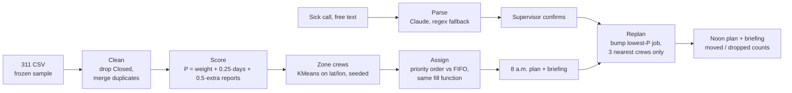

# Who should 311 send next? — a dispatch agent for Calgary Roads

IEEE YP Industry Hackathon · Software and Computational Math · Case 1 ([case brief](docs/CASE_BRIEF.md))

Oldest-first (FIFO) dispatch is fair to the queue, not to the public: a missing stop sign waits
behind yesterday's parking complaint. This agent scores open 311 tickets by hazard, assigns a day
of work to 8 crews × 5 jobs, and replans when a crew calls in sick. It then tells the Roads
supervisor what changed, in plain English.

## Results (frozen sample, same crews and zones for both plans)

| 8 crews × 5 jobs | Oldest-first (FIFO) | Agent, 8 a.m. | Agent, noon (crew 4 out) |
|---|---|---|---|
| Safety tickets covered (30 in the backlog) | 16 | **30** | **30** |
| Total priority P served | 99.0 | **125.75** | 112.75 |
| Jobs on the plan | 40 | 40 | 35 |
| Moved to another crew / dropped | — | — | 2 / 5 (**0 safety dropped**) |

- **Data:** 200 raw tickets → 122 open → 104 after merging duplicate reports → 99 field-crew
  tickets (licence inspections and seniors' inquiries aren't field-crew work).
- **Robustness:** we changed every type weight by ±1 (16 variations). The agent beat FIFO on
  safety in all 16, by +9 to +15 tickets (`python -m tests.sensitivity`).
- **Improvement round:** the first replan let a displaced job bump work anywhere in the city.
  One job travelled 34.9 km. Limiting moves to the 3 nearest crews keeps moves to 11–12 km,
  costs 0.75 P, and still drops no safety ticket.
- **Starter bug we caught:** the starter's `"ice" in name` check matches "Serv**ice**s" and
  "L**ice**nce". Its "priority" plan spent 28 of 40 slots on cart deliveries, commercial
  collection and licence inspections, and scheduled 23 already-closed tickets.

## How it works



| Step | File | What it does |
|---|---|---|
| Clean | `dispatch/data_prep.py` | Loads the CSV, drops Closed tickets, merges duplicate reports (same type, same spot to ~1 m) into one job with a `reports` count |
| Weights | `dispatch/weights.py` | One reviewable table: 3 = safety hazard, 2 = road hazard, 1 = service, 0 = not a field-crew job; a reason for every weight |
| Score | `dispatch/scoring.py` | P = weight + 0.25 × days open + 0.5 × (reports − 1) |
| Assign | `dispatch/assign.py` | KMeans zones (seeded); walks tickets in priority or FIFO order and gives each to the nearest crew with room |
| Replan | `dispatch/replan.py` | Removes the sick crew's jobs; each one, highest P first, may bump a strictly lower-P job from one of its 3 nearest crews; logs moved/dropped |
| Metrics | `dispatch/metrics.py` | P served, safety count, jobs, moved, dropped, safety dropped |
| Language | `dispatch/llm.py` | Claude turns a free-text sick call into a structured event and writes the briefings; regex and template fallbacks run without a key or network |
| Pipeline | `dispatch/run.py` | Runs everything; writes `dispatch/outputs/*.json`, including the 8 a.m. and noon briefings |
| Caller intake | `dispatch/intake.py` | 311 call-taker chat: asks follow-ups until it knows what the problem is and exactly where (OpenStreetMap geocoding), then scores the ticket and names the nearest crew |
| Voice | `dispatch/voice_server.py`, `voice_call.html`, `voice.py` | Hands-free voice call: the browser listens, a local API runs each turn, the agent answers aloud (ElevenLabs, or the browser's voice without a key) |
| Dashboard | `dispatch/app.py` | Streamlit: agent vs FIFO, map, crews, 8 a.m. and noon briefings, the sick-call → replan loop, and the caller chat |

The planning is deterministic code. Claude only reads the supervisor's message and writes the
briefing from numbers the code computed. Every parse is shown to the supervisor before it changes
the plan.

## Run it

Python 3.10 or newer.

```bash
pip install -r requirements.txt
python -m dispatch.run                    # rebuild the plans and outputs; prints both briefings
python -m streamlit run dispatch/app.py   # dashboard at http://localhost:8501
python -m tests.test_core                 # 11 checks, including the numbers above
python -m tests.test_intake               # caller chat: follow-up questions, locations, tickets (offline)
python -m tests.sensitivity               # the ±1 weight table
```

The output files are committed, so the dashboard also works without running the pipeline first.

**Claude (optional).** Copy `.env.example` to `.env` and put your key after `ANTHROPIC_API_KEY=`.
`.env` is gitignored. Without a key, or without internet, the app uses the rule-based parser,
template briefings and a rule-based call-taker, and labels them as such on screen. Check the key with
`python -c "from dispatch.llm import has_api_key; print(has_api_key())"`.

**Caller voice call.** In the dashboard, open **Report an update → Caller report** and press the red
microphone button (Chrome or Edge; allow the microphone). Talk like a caller, e.g. "there's a pothole
where I am right now". The agent answers out loud and keeps listening, asking one follow-up at a time
("Where exactly is the pothole?") until it knows what and where; then it logs a scored ticket and pins
it on the map. You can also type instead. Locations are looked up on OpenStreetMap (needs internet).

**Voice (optional).** Add `ELEVENLABS_API_KEY=` to `.env` and the agent speaks in a natural ElevenLabs
voice. Without it, the call still works using the browser's built-in voice.

## Limits (what this does not do)

- **Frozen data.** A 200-ticket Open Calgary 311 sample (Aug 25–27, 2026), planned as of Aug 28,
  2026. Nothing is live.
- **No street addresses.** The address column in the source is empty. A job's location is its
  latitude/longitude and community name.
- **No routing.** Jobs are assigned to crews, not sequenced into routes. Distance is straight
  line to a crew's zone centre. Street routing is Case 2.
- **Every job is assumed to take the same time.** There are no crew skills or equipment.
- **One disruption at a time.** Each replan starts again from the 8 a.m. plan. A blizzard
  scenario is not implemented.
- **Weights are our judgement,** not City policy. The sensitivity test shows the result doesn't
  hinge on any single weight.
- **FIFO here ignores type for ordering,** but draws from the same 99 field-crew tickets as the
  agent, so both plans pick from the same eligible work.

## Repo layout

| Path | Contents |
|---|---|
| `dispatch/` | The pipeline and dashboard above; `outputs/` holds the generated plans and briefings |
| `tests/` | `test_core.py` (sanity checks and verified numbers), `sensitivity.py` (weight robustness) |
| `data/` | The 311 sample and its source notes |
| `docs/` | Case brief, pitch outline, submission draft |
| `agent_starter.py` | The organizers' starter, kept unmodified for reference (it contains the "ice" bug above) |
| `simulation/` | A separate teammate prototype (SUMO traffic simulation and 3D city view). It is not part of the dispatch pipeline above and has its own README |

Data: The City of Calgary, Open Calgary — 311 Service Requests, Open Government Licence – City of Calgary.
