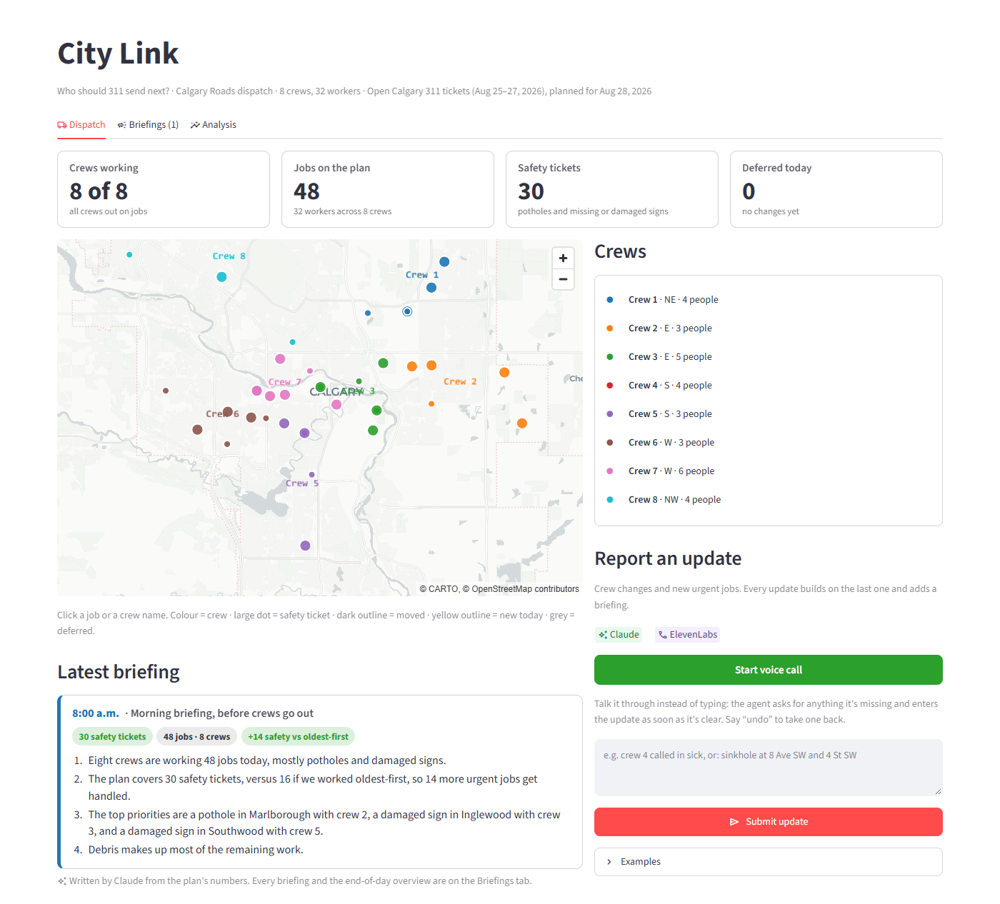
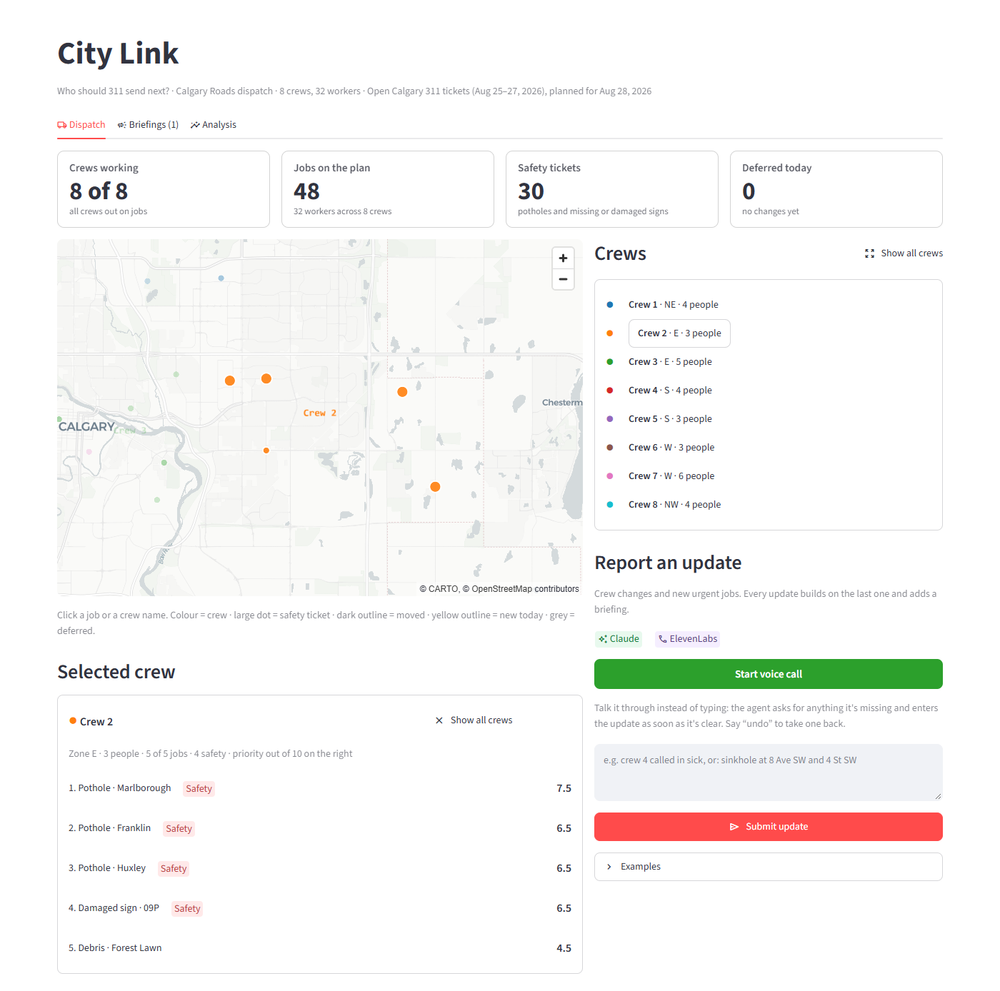
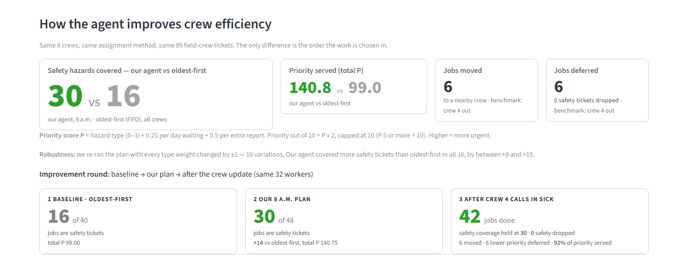
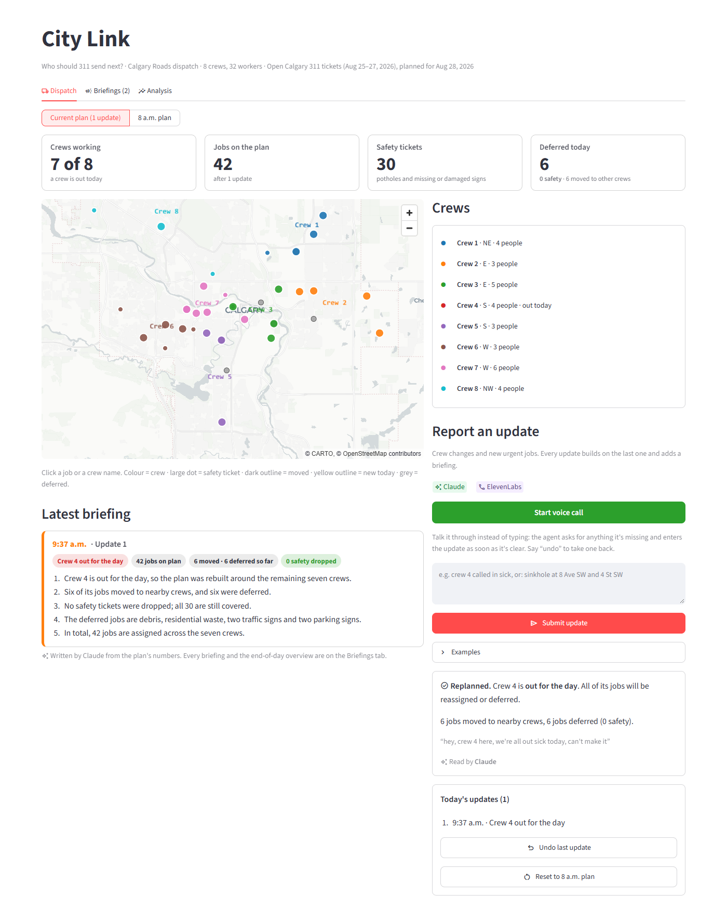
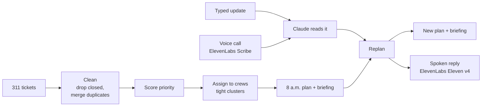

# City Link — who should 311 send next?

A dispatch agent for Calgary Roads. IEEE YP Industry Hackathon · Software and Computational Math · Case 1 ([case brief](docs/CASE_BRIEF.md))

**Demo video:** https://youtu.be/U1Zz6N5E05M

Today, 311 crews work oldest-first, so a missing stop sign can wait behind yesterday's parking
complaint. City Link ranks open tickets by how dangerous they are, plans the day for 8 crews, and
replans in seconds when something changes. Supervisors can type an update or just talk to it on a
**voice call powered by [ElevenLabs](https://elevenlabs.io)**.

## Results

Same 8 crews and 32 workers for both plans, on a frozen sample of Calgary 311 data.

| | Oldest-first | City Link, 8 a.m. | City Link, crew 4 out |
|---|---|---|---|
| Safety hazards covered (of 30) | 16 | **30** | **30** |
| Jobs on the plan | 40 | **48** | 42 |
| Total priority served | 99.0 | **140.75** | 130.0 |
| Jobs moved / deferred | — | — | 6 / 6, **0 safety dropped** |

- **Robust:** we changed every hazard weight up and down (16 versions). City Link beat
  oldest-first on safety every time, by 12 to 15 tickets.
- **Less driving:** each crew gets a tight cluster of nearby jobs. Driving fell from 4.2 km to
  2.8 km per job.
- **Crews sized by workload:** the same 32 workers are split 3 to 6 per crew, so City Link fits
  48 jobs instead of 40.
- **Starter bug we caught:** the starter's `"ice" in name` check matched "Serv**ice**s" and
  "L**ice**nce", so its "priority" plan was mostly cart deliveries and licence inspections.

## Screenshots

**The 8 a.m. plan.** Colour = crew, large dot = safety hazard. Claude writes the morning briefing.



**One crew's day.** Click a crew to see its jobs in priority order.



**City Link vs oldest-first.** 30 safety hazards covered against 16.



**A sick call.** "hey, crew 4 here, we're all out sick today, can't make it" is replanned at once:
6 jobs move to nearby crews, 6 low-priority jobs wait, and no safety job is dropped.



## How it works



1. **Clean.** Drop closed tickets and merge duplicate reports of the same problem.
2. **Score.** Priority = hazard weight (0–3) + 0.25 per day waiting + 0.5 per extra report.
   Potholes and missing or damaged signs are the top weight.
3. **Assign.** Take the top tickets and group them into 8 tight clusters with the Hungarian
   algorithm, so crews drive less.
4. **Update.** A supervisor types or says what changed ("crew 4 is out sick"). Claude reads it;
   on a voice call, ElevenLabs Scribe turns speech into text first, and the agent asks out loud for
   anything missing.
5. **Replan.** The lost crew's jobs move to the nearest crews, bumping lower-priority work if
   needed. A new briefing explains what changed, and on a call the reply is spoken in an
   ElevenLabs Eleven v4 voice.

The planning is plain code. Claude only reads messages and writes briefings; ElevenLabs only
handles the voice. Every update can be undone.

| File | What it does |
|---|---|
| `dispatch/data_prep.py`, `weights.py`, `scoring.py` | Clean the data and score each ticket |
| `dispatch/assign.py`, `replan.py`, `metrics.py` | Build the crew plan, replan, count the results |
| `dispatch/llm.py` | Claude: reads updates, writes briefings (rule-based backup without a key) |
| `dispatch/voice.py` | ElevenLabs: speech-to-text in, spoken replies out |
| `dispatch/call.py`, `call_widget.js` | The voice call: listening, follow-up questions, undo |
| `dispatch/app.py` | The Streamlit dashboard: Dispatch, Briefings and Analysis tabs |
| `dispatch/sim3d.py` | Semir's 3D downtown traffic sim with today's jobs as pins |

## Run it

Python 3.10 or newer.

```bash
pip install -r requirements.txt
python -m streamlit run dispatch/app.py   # dashboard at http://localhost:8501
python -m dispatch.run                    # rebuild the plans (optional, outputs are committed)
python -m tests.test_core                 # checks, including the numbers above
```

More tests: `tests.sensitivity` (weights), `tests.test_call` and `tests.test_voice` (voice call).

**API keys (optional).** Copy `.env.example` to `.env` and add:

- `ANTHROPIC_API_KEY` for Claude. Without it, a rule-based parser and template briefings take over.
- `ELEVENLABS_API_KEY` for the voice call (needs Text to Speech and Speech to Text access). A
  **Start voice call** button appears. Allow the microphone; it only works on `localhost`.

`.env` is gitignored, so your keys stay on your machine.

## Limits

- **Frozen data.** A 200-ticket Calgary 311 sample from Aug 25–27, 2026. Nothing is live.
- **No routes.** Jobs are grouped by crew, not turned into driving directions.
- **Every job takes the same time,** and there are no crew skills or equipment.
- **Crew changes and new jobs only.** Updates stack through the day; city-wide events like a
  blizzard aren't handled.
- **The voice call takes turns.** You can't interrupt it, replies take 2–3 s, and it's English
  only. A quiet room or headset works best.
- **The weights are our judgement,** not City policy, though the result holds when they change.

## Repo layout

| Path | Contents |
|---|---|
| `dispatch/` | The planner and dashboard; `outputs/` holds the generated plans |
| `tests/` | Checks for the numbers, the weights and the voice call |
| `data/` | The 311 sample |
| `docs/` | Case brief, pitch and submission |
| `agent_starter.py` | The organizers' starter, unchanged (it has the "ice" bug) |
| `simulation/` | Semir's SUMO traffic simulation and 3D city, with its own README |

Data: The City of Calgary, Open Calgary — 311 Service Requests, Open Government Licence – City of Calgary.
