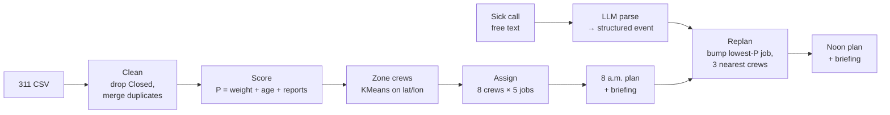

# Pitch: Who should 311 send next?

5-minute pitch + 3-minute Q&A. Times are targets; the demo is the part to protect.

All numbers come from `python -m dispatch.run`, `python -m tests.sensitivity` and the
starter script on `data/311_dispatch_sample.csv`. Re-run them before the pitch if any
weight or engine code changes, and update this page.

| Section | Time | Rubric line it serves |
|---|---|---|
| 1. Problem | 0:00–0:40 | Real industrial problem (20%) |
| 2. The bug we caught | 0:40–1:10 | Autonomous reasoning (30%) |
| 3. Approach + architecture | 1:10–2:00 | Execution + architecture (20%) |
| 4. Live demo | 2:00–3:30 | Execution, reasoning |
| 5. Results vs FIFO | 3:30–4:00 | Autonomous reasoning (30%) |
| 6. Commercialization | 4:00–4:40 | Commercialization (15%) |
| 7. Limits + next steps | 4:40–5:00 | Presentation (15%) |

---

## 1. Problem (0:40)

- **User:** the Calgary Roads / 311 dispatch supervisor who decides, every morning, which
  open tickets 8 crews work today, and re-decides when the plan breaks.
- **Today's default is oldest-first (FIFO).** It is fair to the queue but blind to risk: a
  missing stop sign waits behind a parking-sign complaint because the complaint is older.
- **In our sample:** 122 open tickets, 104 distinct problems once duplicates are merged, 40
  crew slots (8 crews × 5 jobs). FIFO puts only **16 of 30** open safety problems
  (potholes, missing/damaged signs) on today's plan.
- **Then the plan breaks.** A crew calls in sick at noon; the supervisor re-plans by hand.

> Line to say: "Oldest-first is fair to the queue, not to the public. We built the agent that
> decides who 311 sends next — and re-decides when a crew goes down."

## 2. The bug we caught in the starter (0:30)

The starter ranks tickets with keyword matching: `"ice" in name.lower()` → priority 3,
meant for *ice and snow*. But "ice" is inside **Serv*ice*s** and **Lic*ence***:

| Starter's "priority" plan (40 slots) | Count |
|---|---|
| Slots given to false "ice" matches (cart delivery, commercial collection, licence inspection, seniors inquiry) | **28** |
| Slots given to tickets that are already **Closed** | **23** |
| Missing/damaged signs scheduled | **0** |

- **Our fix:** an explicit weight table keyed on the **exact** 10 service names, with a reason
  for every weight (`dispatch/weights.py`), plus a test that fails if a new service type
  appears without a weight.
- We also drop Closed tickets and merge duplicate reports of the same problem (same type,
  same spot to 5 decimals ≈ 1 m) into one job with a `reports` count.

> Line to say: "The starter's 'priority' plan spent 28 of 40 crew slots on cart deliveries
> and licence inspections, because 'Services' contains the word 'ice'."

## 3. Approach + architecture (0:50)

- **Score:** $P = w + 0.25 \cdot \text{days open} + 0.5 \cdot (\text{reports} - 1)$.
  Weight $w$ is 0–3 by type (3 = safety hazard, 0 = not a field-crew job). Age and repeat
  reports break ties so nothing waits forever.
- **Zone:** KMeans splits the city into 8 crew zones (E, NW, W, SE, S, NE, N, central-W).
- **Assign:** walk tickets by priority; each goes to the nearest crew with room. FIFO uses the
  **same** zones and the **same** fill function — only the order differs, so the comparison
  is fair.
- **Disruption:** the supervisor types the sick call in plain English; the LLM turns it into
  `{"event": "crew_out", "crew": 4}`; if it can't tell, it asks a question instead of guessing.
- **Replan:** each of the sick crew's jobs, highest P first, tries its 3 nearest crews and
  bumps that crew's lowest-P job only if it is strictly lower. Everything that changed is
  logged as moved or dropped.

## 4. Live demo script (1:30)

> **TODO (app owner):** the Streamlit app and `llm.parse_event` / `llm.briefing` are not built
> yet. Confirm every button label and step below against the real app, and rehearse once
> end to end. If the app is not ready, run the CLI fallback at the bottom.

Before going on stage: `python -m dispatch.run`, then `streamlit run dispatch/app.py`, browser
open at the app, zoom 125%, API key set (or template fallback confirmed working).

1. **Click "8 a.m. plan".** Point at the map: 8 colour-coded zones, 40 jobs.
   Say: "Every crew gets 5 jobs near its zone; every one of the 30 safety problems is on today's plan."
2. **Click the "FIFO" toggle.** Say: "Same crews, same zones, oldest-first. Only 16 safety
   problems — 14 potholes and broken signs are left for another day."
3. **Toggle back to "Agent".** Read the first two lines of the 8 a.m. briefing aloud.
4. **Type in the sick-call box:** `Crew 4 called in sick, they're out for the day.`
   **Click "Apply".** Show the parsed event: `crew_out`, crew 4.
5. **Point at the noon plan:** crew 4 is empty; 2 of its jobs moved to crew 5 (S zone,
   11–12 km away), 5 lower-priority jobs dropped — **0 of them safety**.
6. **Read the noon briefing** — what changed and why.
7. *(If time allows)* type something vague, e.g. `someone on the south crew isn't feeling great`,
   and show the agent asking a clarifying question instead of guessing.

**CLI fallback** (if the app fails): `python -m dispatch.run`, then
`python -m tests.test_core` (7 PASS) and `python -m tests.sensitivity` (table below).

## 5. Results vs FIFO (0:30)

| Same 8 crews × 5 jobs | FIFO | Agent 8 a.m. | Agent noon (crew 4 out) |
|---|---|---|---|
| Safety problems covered (of 30) | 16 | **30** | **30** |
| Total priority P | 99.0 | **125.75** | 112.75 |
| Jobs | 40 | 40 | 35 |
| Moved / dropped | — | — | 2 / 5 (0 safety dropped) |

What fills the 40 slots:

- **FIFO:** 9 potholes, 7 damaged signs, 8 debris, 6 parking signs, 3 commercial waste,
  3 residential waste, 2 traffic signs, 2 new carts.
- **Agent:** 16 potholes, 14 damaged signs, 7 debris, 3 traffic signs.

**The reasoning loop (baseline → first result → improved result):**

1. **Baseline:** FIFO covers 16 of 30 safety problems.
2. **First result:** the agent covers 30 of 30. The first replan sent crew 4's jobs to whichever
   crew had the lowest-priority job anywhere — one job went **34.9 km** across the city for a
   tiny priority gain.
3. **Improved result:** we capped bumping to the **3 nearest crews**. Moved jobs now travel
   11–12 km, total P drops by only 0.75 (113.5 → 112.75), and still **no safety job is dropped**.

**Robust to our weight choices:** we moved every type's weight by ±1 (16 variations). The agent
beats FIFO on safety in **all 16**, by +9 to +15 (baseline +14).

## 6. Commercialization (0:40)

- **Pilot:** one Calgary Roads district, 6–8 weeks, running in shadow mode next to the
  supervisor's own plan. Success measures: safety tickets closed per day, average age of
  open safety tickets, and supervisor minutes spent re-planning after a disruption.
- **Deployment:** read open tickets from the city's 311 / work-order system each morning,
  write the plan back as work orders. The supervisor approves; the agent never dispatches on
  its own. Weights live in one reviewable table that Roads owns.
- **Scaling:** more crews and jobs per crew are parameters; new ticket types are one line in
  the weight table (and a failing test until they're added); other cities use the same
  311 open-data shape. Next disruptions to add: blizzard (re-weight ice/snow), equipment
  breakdown.

## 7. Limits + next steps (0:20)

- **Limits:** straight-line distance, not road routing; every job assumed to take the same
  time; weights are our judgement, not Calgary policy; one disruption at a time; a
  200-ticket sample.
- **Next:** job durations and crew skills, real routing (Case 2), learn weights from historical
  close-out data, validate weights with a Roads supervisor.

> Closing line: "Same crews, same day — twice the safety work done, and a plan that survives
> the sick call."

---

## Likely judge questions

**1. Why these weights?**
Three is a public-safety hazard (potholes damage vehicles and throw cyclists; a missing stop
sign is a crash risk). Two is a road hazard that's usually avoidable (debris, faded markings).
One is service or nuisance (parking signs, waste, carts). Zero means it isn't a field-crew job
at all (licence inspections, seniors inquiries). Every weight has a one-line reason in
`weights.py`, and a Roads supervisor would own the table in a real pilot.

**2. Doesn't the result just depend on the weights you picked?**
We tested that. Moving any single weight up or down by one still has the agent ahead of FIFO
on safety in all 16 cases, by +9 to +15 tickets.

**3. Is it really autonomous, or just a sort?**
It plans the day, zones the crews, reads a free-text disruption, decides what moves and what
drops, and explains its decisions. It also asks instead of guessing when the message is
unclear. The human approves; they don't re-plan.

**4. What if the LLM misreads the sick call?**
The LLM only produces a small structured event: event type, crew number and capacity.
Anything it isn't sure about comes back as `unclear` with a question, and the plan doesn't
change. The event is shown to the supervisor before the replan is applied, and the planning
itself is deterministic code, not the LLM.

**5. Why not use an optimizer (MIP / OR-Tools)?**
At this size a greedy fill is fast, explainable line by line, and already covers every safety
ticket. An optimizer is a drop-in upgrade for the assignment step when we add job durations
and routing.

**6. How does it scale?**
Scoring and assignment are linear in the number of tickets. KMeans zoning is fast for
thousands of points, and crews and jobs per crew are parameters. A city-wide run is seconds,
not minutes.

**7. Won't low-priority tickets wait forever?**
No, because age is in the score: each day open adds 0.25, so a weight-1 ticket catches up
with a fresh weight-3 ticket after 8 days and passes it after 9. Duplicate reports also raise it.

**8. How would the city actually adopt this?**
Start with a shadow-mode pilot in one Roads district, connected to the existing work-order
system. Measure safety tickets closed and time spent re-planning, then expand by district.
