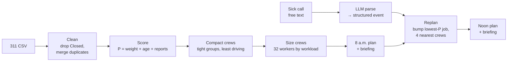

# Pitch: City Link — who should 311 send next?

5-minute pitch + 3-minute Q&A. Times are targets; the demo is the part to protect.

All numbers come from `python -m dispatch.run`, `python -m tests.sensitivity` and the
starter script on `data/311_dispatch_sample.csv`. Re-run them before the pitch if any
weight or engine code changes, and update this page.

| Section | Time | Rubric line it serves |
|---|---|---|
| 1. Problem | 0:00–0:40 | Real industrial problem (20%) |
| 2. The bug we caught | 0:40–1:10 | Autonomous reasoning (30%) |
| 3. Approach + architecture | 1:10–2:00 | Execution + architecture (20%) |
| 4. Live demo | 2:00–3:30 | Execution, reasoning |
| 5. Results vs FIFO | 3:30–4:00 | Autonomous reasoning (30%) |
| 6. Commercialization | 4:00–4:40 | Commercialization (15%) |
| 7. Limits + next steps | 4:40–5:00 | Presentation (15%) |

---

## 1. Problem (0:40)

- **User:** the Calgary Roads / 311 dispatch supervisor who decides, every morning, which
  open tickets 8 crews work today, and re-decides when the plan breaks.
- **Today's default is oldest-first (FIFO).** It is fair to the queue but blind to risk: a
  missing stop sign waits behind a parking-sign complaint because the complaint is older.
- **In our sample:** 122 open tickets, 104 distinct problems once duplicates are merged, and
  8 crews with 32 workers. FIFO fills 40 crew slots but puts only **16 of 30** open safety problems
  (potholes, missing/damaged signs) on today's plan.
- **Then the plan breaks.** A crew calls in sick at noon; the supervisor re-plans by hand.

> Line to say: "Oldest-first is fair to the queue, not to the public. We built the agent that
> decides who 311 sends next — and re-decides when a crew goes down."

## 2. The bug we caught in the starter (0:30)

The starter ranks tickets with keyword matching: `"ice" in name.lower()` → priority 3,
meant for *ice and snow*. But "ice" is inside **Serv*ice*s** and **Lic*ence***:

| Starter's "priority" plan (40 slots) | Count |
|---|---|
| Slots given to false "ice" matches (cart delivery, commercial collection, licence inspection, seniors inquiry) | **28** |
| Slots given to tickets that are already **Closed** | **23** |
| Missing/damaged signs scheduled | **0** |

- **Our fix:** an explicit weight table keyed on the **exact** 10 service names, with a reason
  for every weight (`dispatch/weights.py`), plus a test that fails if a new service type
  appears without a weight.
- We also drop Closed tickets and merge duplicate reports of the same problem (same type,
  same spot to 5 decimals ≈ 1 m) into one job with a `reports` count.

> Line to say: "The starter's 'priority' plan spent 28 of 40 crew slots on cart deliveries
> and licence inspections, because 'Services' contains the word 'ice'."

## 3. Approach + architecture (0:50)

- **Score:** $P = w + 0.25 \cdot \text{days open} + 0.5 \cdot (\text{reports} - 1)$.
  Weight $w$ is 0–3 by type (3 = safety hazard, 0 = not a field-crew job). Age and repeat
  reports break ties so nothing waits forever.
- **Choose the work:** the top 40 tickets by priority (FIFO takes the 40 oldest). Everything
  after that is the **same** code for both plans, so the comparison is fair.
- **Compact crews:** the jobs are split into 8 tight groups that minimise driving, and a clean-up
  pass swaps jobs between crews until no swap shortens anyone's drive (2.8 km per job, was 4.2).
- **Flexible crews:** the same 32 workers are split by workload (3 to 6 per crew); a crew's job
  limit follows its size plus jobs within 1 km of each other, up to 7. The agent covers **48
  jobs** with the same people. FIFO keeps standard crews (4 people, 5 jobs).
- **Disruption:** the supervisor types the sick call in plain English; the LLM turns it into
  `{"event": "crew_out", "crew": 4}`; if it can't tell, it asks a question instead of guessing.
- **Replan:** each of the sick crew's jobs, highest P first, tries its 4 nearest crews and
  bumps that crew's lowest-P job only if it is strictly lower. Everything that changed is
  logged as moved or dropped.

## 4. Live demo script (1:30)

Before going on stage:
- In a terminal: `cd` into the repo, then `python -m streamlit run dispatch/app.py`. Open
  http://localhost:8501 (the City Link dashboard; localhost:8765 is the 3D sim on its own) at 125% zoom.
- **Open the page once before you present.** The first load after starting Streamlit waits for
  Claude to write the 8 a.m. briefing (5–10 s); after that it's instant for everyone.
- Check the badge next to **Report an update**: green **Claude** means the key works; grey
  **Rule-based** means you're offline. That's fine, but say so if asked. A purple **ElevenLabs**
  badge means the voice call is available (allow the microphone when the browser asks; it only works
  on `localhost`, not a LAN address). Turn the volume up, and use a quiet spot or a headset mic.
- On venue wifi with no internet, set `USE_LLM = False` in `dispatch/llm.py`. Otherwise each
  Claude attempt waits for a timeout before falling back.
- 3D downtown (optional): on the **Analysis** tab, click **Start the 3D sim** about 15 s before
  you need it (SUMO must be installed with `simulation\setup.bat`).
- Use a normal browser window (not an emulated size), so map clicks land on the dots.

1. **Dispatch tab, top cards:** "8 of 8 crews working", "48 jobs on the plan", "30 safety
   tickets". Say: "Same 32 workers as oldest-first. Our plan covers all 30 safety hazards and 48
   jobs; oldest-first covers 16 safety hazards in 40 jobs."
2. **Click "Crew 7 · W · 6 people"** in the crew list. The map zooms to that crew's tight cluster,
   and its jobs appear under the map with a priority out of 10 and red **Hazard** labels. Say: "Busy
   areas get bigger crews: this one has 6 people and 7 jobs." Click a job (or a dot on the map) to
   show its priority breakdown, then **Show all crews**.
3. **Read the first two lines of the Latest briefing** under the map (the 8 a.m. briefing).
4. **Type in the Report an update box:** `hey, crew 4 here, we're all out sick today, can't make it`,
   then click **Submit update**. There's no confirm step; the agent replans at once:
   - The result box reads "**Replanned.** Crew 4 is **out for the day**…" and "Read by **Claude**".
   - The plan switch shows **Current plan (1 update)**; the crew list shows "Crew 4 · S · 4 people · out today".
   - **Deferred today** shows **6**, "**0 safety** · 6 moved to other crews".
5. **Read the new Latest briefing** (Update 1). Say: "The supervisor gets a plain-English update
   after every change."
6. **Voice call** *(if the ElevenLabs badge is on)*: click **Start voice call**. The agent says
   "City Link dispatch. What's the update?" Say *"someone called in sick"* and pause. It asks which
   crew instead of guessing; say *"four"*. It enters the update straight away, says what changed and
   asks "Anything else?". Say *"undo"* to take it back, or *"no, it was crew 3"* to fix it; say
   *"no, that's all"* to hang up. *(Without voice, type* `someone called in sick` *and answer* `4`
   *in the box.)*
7. **Briefings tab:** the 8 a.m. briefing and one card per update. Click **Close out the day** to
   show the end-of-day overview.
8. **Analysis tab:** "30 vs 16" safety hazards against oldest-first, the improvement round
   (baseline → our plan → crew 4 out), and "Where crew time goes" (62% vs 40% of slots on safety
   work; 17.6 vs 12.4 priority served per crew; 4 vs 14 slots on low-priority work). Point at the system diagram if asked how it works.
   Use **Undo last update** or **Reset to 8 a.m. plan** on the Dispatch tab to start the demo again.

**CLI fallback** (if the app fails): run `python -m dispatch.run`, which prints the numbers and
both briefings. Then run `python -m tests.test_core` (11 PASS) and `python -m tests.sensitivity`
(table below).

## 5. Results vs FIFO (0:30)

| Same 8 crews, 32 workers | FIFO | Agent 8 a.m. | Agent noon (crew 4 out) |
|---|---|---|---|
| Safety problems covered (of 30) | 16 | **30** | **30** |
| Total priority P | 99.0 | **140.75** | 130.0 |
| Jobs | 40 | **48** | 42 |
| Moved / dropped | — | — | 6 / 6 (0 safety dropped) |

What each plan sends crews to:

- **FIFO (40 jobs):** 9 potholes, 7 damaged signs, 8 debris, 6 parking signs, 3 commercial waste,
  3 residential waste, 2 traffic signs, 2 new carts.
- **Agent (48 jobs):** 16 potholes, 14 damaged signs, 10 debris, 4 traffic signs, 2 parking signs,
  2 residential waste.

**The reasoning loop (baseline → first result → improved result):**

1. **Baseline:** FIFO covers 16 of 30 safety problems.
2. **First result:** the agent covers 30 of 30. The first replan sent crew 4's jobs to whichever
   crew had the lowest-priority job anywhere — one job went **34.9 km** across the city for a
   tiny priority gain.
3. **Improved result:** bumping is limited to the **4 nearest crews**, and crews are compact
   groups sized by workload. With crew 4 out, the replan moves 6 jobs to neighbouring crews,
   defers 6 lower-priority ones, keeps 130.0 of the 8 a.m. plan's 140.75 priority, and still
   **drops no safety job**. Losing any one of the 8 crews drops no safety job either.

**Robust to our weight choices:** we moved every type's weight by ±1 (16 variations). The agent
beats FIFO on safety in **all 16**, by +12 to +15 (baseline +14).

## 6. Commercialization (0:40)

- **Pilot:** one Calgary Roads district, 6–8 weeks, running in shadow mode next to the
  supervisor's own plan. Success measures: safety tickets closed per day, average age of
  open safety tickets, and supervisor minutes spent re-planning after a disruption.
- **Deployment:** read open tickets from the city's 311 / work-order system each morning,
  write the plan back as work orders. The supervisor approves; the agent never dispatches on
  its own. Weights live in one reviewable table that Roads owns.
- **Scaling:** more crews and jobs per crew are parameters; new ticket types are one line in
  the weight table (and a failing test until they're added); other cities use the same
  311 open-data shape. Next disruptions to add: blizzard (re-weight ice/snow), equipment
  breakdown.

## 7. Limits + next steps (0:20)

- **Limits:** straight-line distance, not road routing; every job assumed to take the same
  time; weights are our judgement, not Calgary policy; one disruption at a time; a
  200-ticket sample.
- **Next:** job durations and crew skills, real routing (Case 2), learn weights from historical
  close-out data, validate weights with a Roads supervisor.

> Closing line: "Same crews, same day — twice the safety work done, and a plan that survives
> the sick call."

---

## Likely judge questions

**1. Why these weights?**
Three is a public-safety hazard (potholes damage vehicles and throw cyclists; a missing stop
sign is a crash risk). Two is a road hazard that's usually avoidable (debris, faded markings).
One is service or nuisance (parking signs, waste, carts). Zero means it isn't a field-crew job
at all (licence inspections, seniors inquiries). Every weight has a one-line reason in
`weights.py`, and a Roads supervisor would own the table in a real pilot.

**2. Doesn't the result just depend on the weights you picked?**
We tested that. Moving any single weight up or down by one still has the agent ahead of FIFO
on safety in all 16 cases, by +12 to +15 tickets.

**3. Is it really autonomous, or just a sort?**
It plans the day, zones the crews, reads a free-text disruption, decides what moves and what
drops, and explains its decisions. It also asks instead of guessing when the message is
unclear. The human approves; they don't re-plan.

**4. What if the LLM misreads the sick call?**
The LLM only produces a small structured event: event type, crew number and capacity.
Anything it isn't sure about comes back as `unclear` with a question, and the plan doesn't
change. The event is shown to the supervisor before the replan is applied, and the planning
itself is deterministic code, not the LLM.

**5. Why not use an optimizer (MIP / OR-Tools)?**
We already use one where it pays off: the crew grouping is an optimal (Hungarian) assignment,
followed by a clean-up pass that swaps jobs until no swap shortens driving. Choosing *which*
tickets to do stays a transparent priority ranking, which already covers every safety ticket.
A full optimizer (MIP / OR-Tools) is the next step once we add job durations and routing.

**6. How does it scale?**
Scoring is linear in the number of tickets, and the whole plan for today's sample builds in
about 3 seconds. Crews, workers and job limits are parameters. A city-wide run stays in seconds;
the exact route-ordering step would switch to a fast heuristic for crews with many more jobs.

**7. Won't low-priority tickets wait forever?**
No, because age is in the score: each day open adds 0.25, so a weight-1 ticket catches up
with a fresh weight-3 ticket after 8 days and passes it after 9. Duplicate reports also raise it.

**8. How would the city actually adopt this?**
Start with a shadow-mode pilot in one Roads district, connected to the existing work-order
system. Measure safety tickets closed and time spent re-planning, then expand by district.
